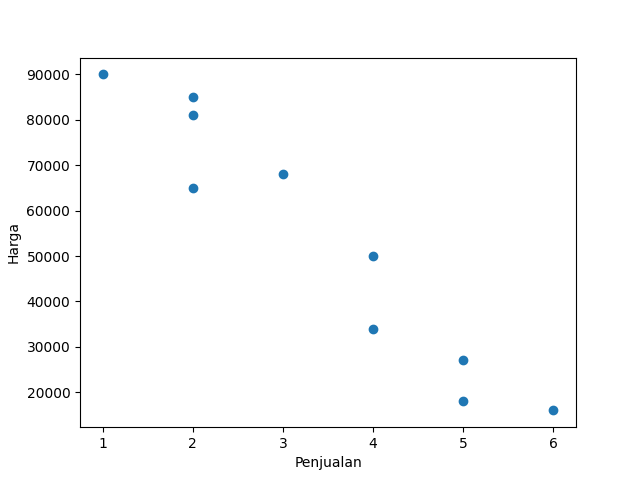
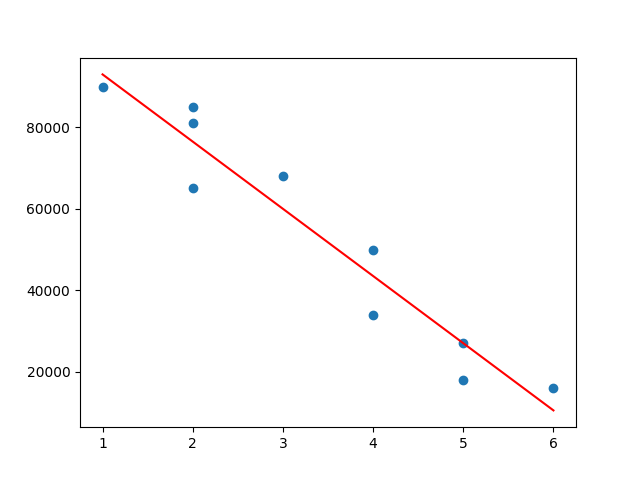
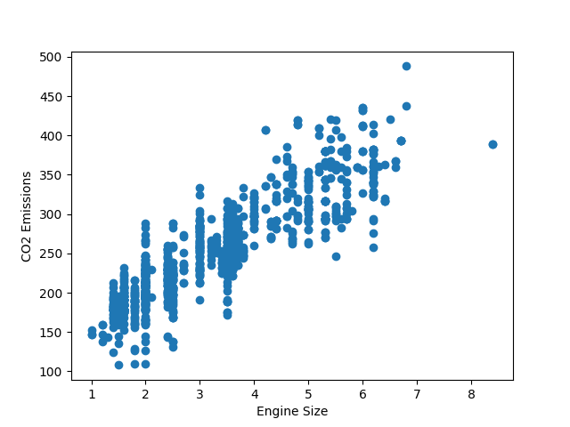
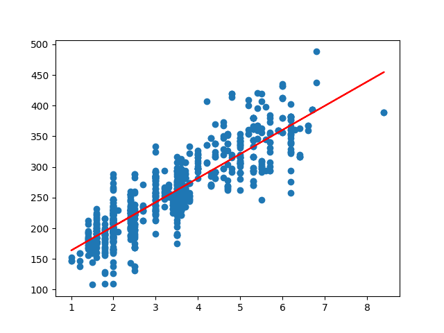

# 📊 Regresi Linear Sederhana (Modul 1 & Modul 2)

## 📌 Deskripsi

Project ini merupakan implementasi **Regresi Linear Sederhana** menggunakan Python sebagai bagian dari tugas pembelajaran machine learning.
Terdapat dua modul yang dikerjakan:

* **Modul 1**: Menggunakan data manual (array)
* **Modul 2**: Menggunakan dataset CSV (Fuel Consumption)

---

## 🧠 Modul 1: Regresi Linear dengan Data Sederhana

Pada modul ini digunakan data penjualan dan harga untuk melihat hubungan antara keduanya.

### 📷 Hasil Visualisasi

* Scatter Plot Awal
  

* Scatter Plot + Garis Regresi
  

### 📖 Penjelasan

Data penjualan digunakan sebagai variabel independen (X), sedangkan harga sebagai variabel dependen (Y).
Hasil menunjukkan adanya hubungan linear yang dapat divisualisasikan melalui garis regresi.

---

## 🚗 Modul 2: Regresi Linear dengan Dataset

Pada modul ini digunakan dataset **FuelConsumptionCo2** untuk menganalisis hubungan antara ukuran mesin dan emisi CO2.

### 📷 Hasil Visualisasi

* Scatter Plot Awal
  

* Scatter Plot + Garis Regresi
  

### 📖 Penjelasan

Variabel yang digunakan:

* X = Engine Size
* Y = CO2 Emissions

Hasil menunjukkan bahwa semakin besar ukuran mesin, maka emisi CO2 cenderung meningkat.

---

## ⚙️ Teknologi yang Digunakan

* Python
* NumPy
* Pandas
* Matplotlib
* Scikit-learn

---

## 🎯 Kesimpulan

Dari kedua modul, dapat disimpulkan bahwa:

* Regresi linear dapat digunakan untuk melihat hubungan antar variabel
* Visualisasi membantu memahami pola data
* Model mampu memprediksi nilai berdasarkan hubungan yang terbentuk

---

## ▶️ Cara Menjalankan

```bash
python modul1.py
python main.py
```
